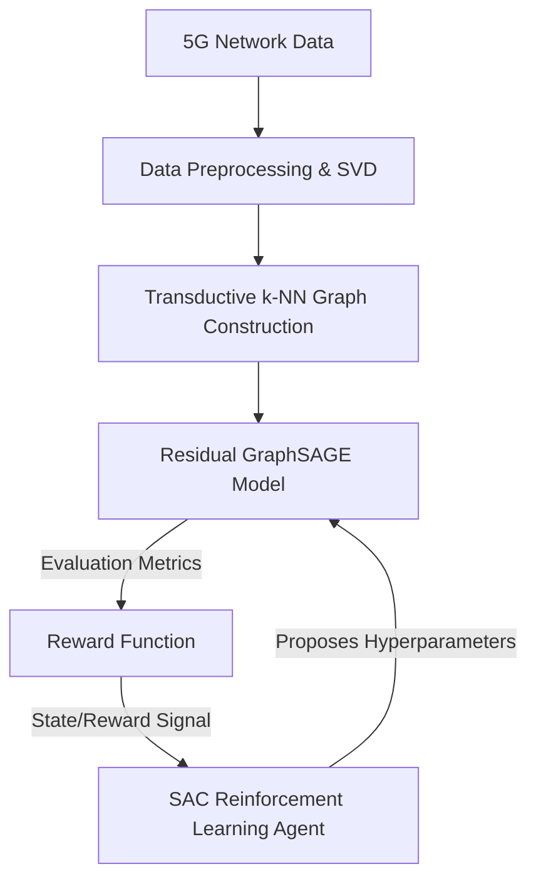

<div align="center">
  
# SAC-GRAPH5G: Research-Grade GNN + Reinforcement Learning for 5G Network Optimization

[](https://opensource.org/licenses/MIT)
[](https://www.python.org/downloads/)
[](https://pytorch.org/)

An enterprise-grade implementation of **Soft Actor-Critic (SAC) controlled Residual GraphSAGE** for optimizing and analyzing 5G wireless network data.

</div>

## 📌 Overview

**SAC-GRAPH5G** tackles the challenge of optimizing deep learning models for wireless network data, where instances often share behavior implicitly through slice properties, traffic type, QoS state, and radio conditions. By constructing a transductive $k$-NN graph over the 5G data features, this project uses a Residual GraphSAGE model to effectively capture network topological similarities. 

Instead of traditional hyperparameter search (like grid search or basic Bayesian optimization), this framework uses a **Soft Actor-Critic (SAC)** reinforcement learning agent to dynamically search the space of GNN hyperparameters (graph density, network depth, learning rate, etc.) by conditioning on complex state representations, including class imbalance, feature dispersion, and reward history.

## 🏗️ Architecture



## 🚀 Key Features

* **Modular Architecture**: Clean separation of data processing, GNN models, RL controllers, and training loops.
* **Residual GraphSAGE**: Custom implementation of GraphSAGE with residual connections and layer normalization for deep graph learning without oversmoothing.
* **RL-Driven Optimization**: A robust implementation of Soft Actor-Critic specifically tuned for hyperparameter search in deep learning environments.
* **Comprehensive Benchmarking**: Out-of-the-box comparisons with Logistic Regression, Random Forest, MLP, Random Search, and Optuna (TPE).
* **Enterprise Ready**: Fully packaged with `pyproject.toml`, integrated CI via GitHub Actions, and scalable design.

## 📦 Installation

We recommend using a virtual environment (e.g., `venv` or `conda`):

```bash
# Clone the repository
git clone https://github.com/newabdennour/SAC-Based-GNN-RL-for-Wireless-Network-Optimization.git
cd SAC-Based-GNN-RL-for-Wireless-Network-Optimization

# Install the package and dependencies
pip install -e .
```

## 💻 Usage

Ensure you have your 5G network dataset placed at `dataset/5g_network_data.csv`.

To run the full pipeline (data loading, baselines, and search strategies):

```bash
python src/main.py
```

To run a fast smoke-test (useful for debugging and verifying local environments):

```bash
python src/main.py --smoke-test
```

### Outputs

The pipeline generates several artifacts in the `sac_graph5g_outputs/` directory:
- `all_seed_results.csv`: Detailed performance metrics for every model and seed.
- `mean_std_summary.csv`: Aggregated multi-seed performance tables.
- `controller_search_history.csv`: History of proposed parameters and rewards by the search controllers.
- `experiment_metadata.json`: Full configuration details of the run.

## 🧪 Testing

To run the unit tests, install the development dependencies and run `pytest`:

```bash
pip install -e .[dev]
pytest tests/
```

## 📖 Project Structure

```text
SAC-GRAPH5G/
├── dataset/                  # Contains the 5G data (e.g., 5g_network_data.csv)
├── notebooks/                # Jupyter notebooks for interactive exploration
├── src/
│   ├── sac_graph5g/
│   │   ├── data/             # Data preprocessing and graph construction
│   │   ├── models/           # GNN architectures and classical baselines
│   │   ├── rl/               # SAC Agent and MDP Environment definitions
│   │   ├── training/         # Training loops and search controllers
│   │   ├── config.py         # Global project configurations
│   │   └── utils.py          # Helper functions and metric calculators
│   └── main.py               # Main CLI entrypoint
├── tests/                    # Unit tests
├── pyproject.toml            # Python package metadata
└── README.md
```

## 📜 License

This project is licensed under the MIT License - see the [LICENSE](LICENSE) file for details.
